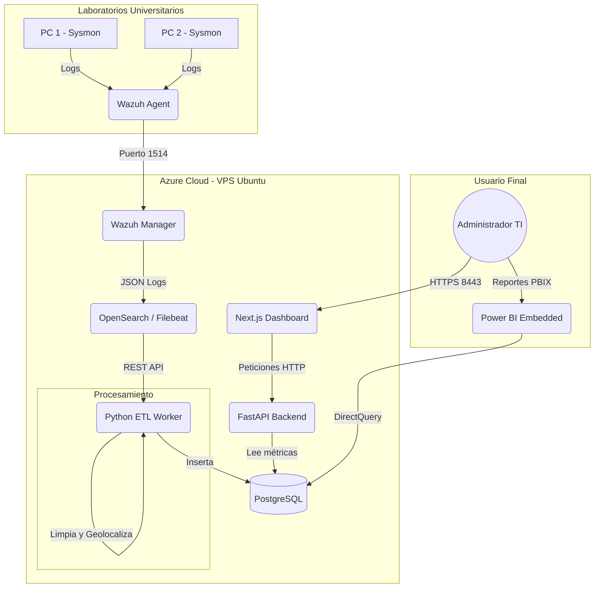

# 🛡️ Sysmon Telemetry Platform

Plataforma unificada para la captura, procesamiento y visualización de tráfico de red a nivel de endpoints utilizando Sysmon, Wazuh, PostgreSQL, Python ETL y Next.js.

## 📐 Arquitectura del Sistema

El sistema utiliza una arquitectura orientada a eventos para capturar el tráfico de red de los laboratorios en tiempo real.

## 🚀 Tecnologías Utilizadas
- **Infraestructura:** Terraform, Microsoft Azure.
- **Seguridad y Captura:** Sysmon (Event ID 3), Wazuh HIDS.
- **Data Pipeline:** Python 3, OpenSearch, MaxMind GeoIP.
- **Almacenamiento:** PostgreSQL.
- **Frontend & BI:** React / Next.js, Power BI.
- **CI/CD:** GitHub Actions.

## 🛠️ Despliegue Automático (Terraform)
La infraestructura se levanta en Azure utilizando Terraform.
1. Instalar Terraform y Azure CLI (`az login`).
2. Entrar a `infrastructure/terraform`.
3. Ejecutar `terraform init && terraform apply -auto-approve`.

## 📦 Estructura del Repositorio
- `/infrastructure`: Scripts de Terraform para IaC.
- `/server`: Backend en FastAPI y script ETL (`worker.py`).
- `/dashboard`: Frontend en Next.js.
- `/installer`: Código fuente del instalador para las PCs clientes en C#.
- `/docs`: Informes del proyecto (FD01 - FD05) y Diccionario de Datos.
